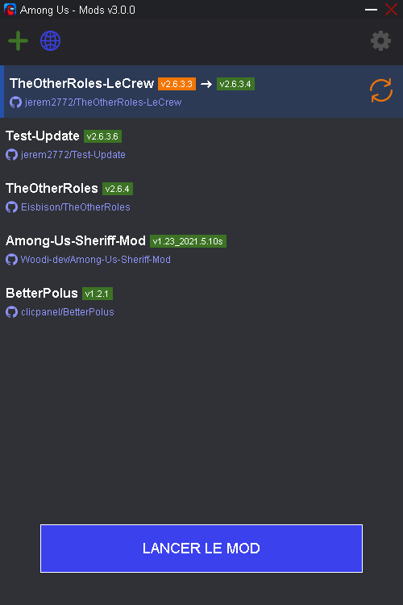

# [Among Us - Mods v3.0.1](https://github.com/clicpanel/among-us-mods)
## Gestionnaire de mod pour Among Us
La gestion des mods pour Among Us simplifiée au maximum. Grâce à cette application vous pourrez installer, mettre à jour et restaurer une version précédente des mods Among Us sans aucune manipulation.

### [Télécharger Among Us Mods v3.0.1 pour Windows (installeur)](https://github.com/clicpanel/among-us-mods/releases/download/v3.0.1/Among.Us.-.Mods.installer.exe)

> Cette application utilise les liens symboliques pour greffer les mods à votre jeu Among Us. De cette façon vous n'avez pas besoin de créer une copie de votre dossier contenant le jeu pour y installer des mods.

## Sommaire
- [Première utilisation](#première-utilisation)
- [Fonctionnalités](#fonctionnalités)
- [Compatibilité des mods](#compatibilité-des-mods)
- [Signaler un problème](#signaler-un-problème)
- [Contributions](#contributions)

### Première utilisation
Lors du premier lancement de l'application vous vous retrouverez sur la configuration. 
Vous devrez sélectionner l'exécutable `Among Us.exe` que l'application utilisera pour y greffer les mods que vous voudrez utiliser. Veillez à bien sélectionner l'exécutable et non le raccourci.

### Fonctionnalités
- Une interface simple et intuitive.
  

- Téléchargement des mods simplement via l'URL de leur dépôt Github.
  

- Ouvrir le dépôt, le dossier, restaurer une version précédente ou désinstaller simplement avec un clique-droit.

- Restaurer une version précédente d'un mod installé.

- L'application informe de la dernière version disponible si celle-ci n'est pas déjà installée.

- Effectuer une mise à jour en un seul clique.

- Gérer les serveurs privés.

- Ajouter un serveur privé.

- Impossible d'intéragir avec l'application si `Among Us` est lancé.

### Compatibilité des mods
Les mods qui souhaitent être compatible avec cette application doivent respecter certains critères :
- Disposer d'une archive `.zip` dans chaque release de version content la version BepInEx compatible et le plugin `.dll` du mod.
- (optionnel) Disposer du plugin `.dll` dans chaque release uniquement si la release précédente utilise la même version de BepInEx.
- Les fichiers dans l'archive de la release ne doivent pas être dans un sous-dossier.
  
### Signaler un problème
Verifier si le problème rencontré n'a pas déjà été signalé dans [les issues](https://github.com/clicpanel/among-us-mod-manager/issues). Si ça n'est pas le cas vous pouvez [ouvrir une nouvelle issue](https://github.com/clicpanel/among-us-mods/issues/new).

### Contributions
Ce projet accepte les `pull requests` si le code est propre, respecte les conventions du projet et si la modification apportée est jugée pertinente.
